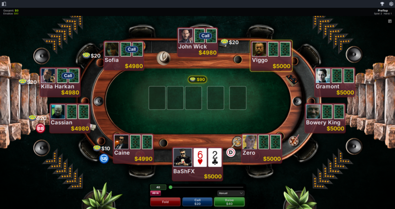
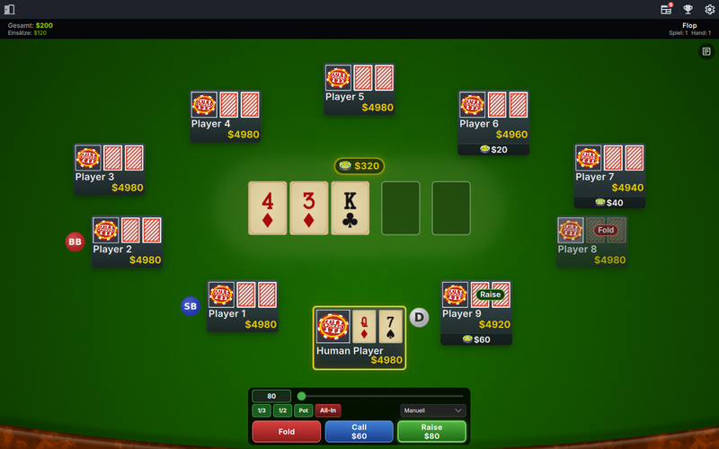
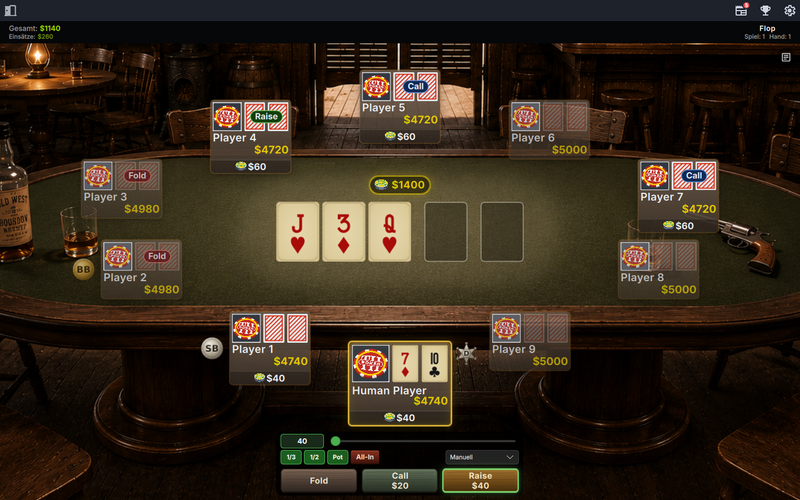
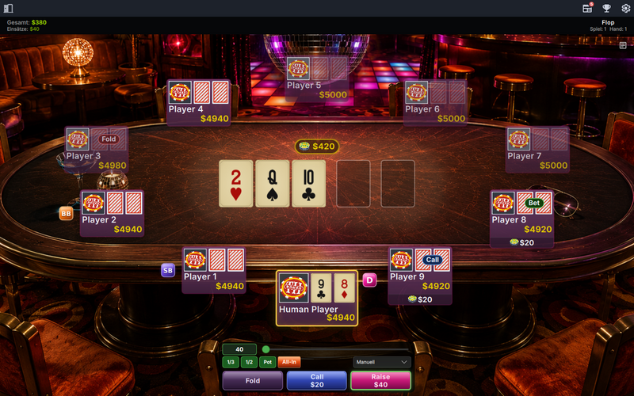

<div align="center">


# PokerTH

**The open source Texas Hold'em engine — play against the computer or against other people over the internet.**

[](COPYING)
[](ChangeLog)
[](https://www.qt.io/)
[](CMakeLists.txt)

[Website & Forum](https://www.pokerth.net) · [Download](https://www.pokerth.net/download) · [Issues](https://github.com/pokerth/pokerth/issues) · [ChangeLog](ChangeLog)



</div>

---

## About

PokerTH is a poker game written in C++ with Qt. You can play the popular Texas
Hold'em poker variant against up to nine computer opponents or against real
people on the internet — on the official server at pokerth.net, or on any
dedicated server you run yourself.

The project has been around since 2006, is licensed under the **AGPLv3**, and
carries no ads, no real-money gambling and no tracking.

## Features

- **Texas Hold'em, 2–10 players** — single player against bots, local network or internet play
- **Tournament-style games** — start money, blind levels raised by hand count or by minutes, manual blind orders, action timeouts and configurable GUI speed
- **Public, registered-only, invite-only and ranking games**, with optional spectators
- **Lobby** with player list, game list, chat, emoji reactions and private messages that persist per account
- **Chat translation** on demand (opt-in, see [docs/third_party_services.md](docs/third_party_services.md))
- **Looks** — 20 table themes, 11 card decks, several card backsides, import/export of themes as ZIP
- **29 languages**, with the full UI translated
- **Cross platform** — Linux, Windows, macOS, Android and iOS
- **Own server** — a dedicated server binary you can run anywhere ([docs/server_setup_howto.txt](docs/server_setup_howto.txt))

<div align="center">



</div>

## Download

The ready-made packages for every platform are linked from
**[pokerth.net/download](https://www.pokerth.net/download)**. Depending on your
system:

| Platform | Package |
| --- | --- |
| Linux | Flatpak (`net.pokerth.PokerTH`), Snap (`pokerth`), AppImage, `.deb`, portable ZIP |
| Windows | Installer (contains both clients) |
| macOS | DMG (contains both clients) |
| Android | APK from the PokerTH F-Droid repo: `https://www.pokerth.net/fdroid/repo` |
| iOS | see [build_ios_qml.sh](build_ios_qml.sh) — no App Store build yet |

## The two clients

This repository builds **two desktop clients** that speak the same protocol and
share the whole engine, networking and database layer below the GUI:

| Target | GUI | Status |
| --- | --- | --- |
| `pokerth_qml-client` | Qt Quick / QML ([src/gui/qt6-qml](src/gui/qt6-qml)) | current client, all platforms, scales from phone to desktop |
| `pokerth_client` | Qt Widgets ([src/gui/qt](src/gui/qt)) | the classic desktop client; 2.1.9 is its final release |

Server side there are two server binaries: `pokerth_dedicated_server` for
everybody who wants to host games, and `pokerth_official_server`, which adds the
user database used by pokerth.net.

## Building from source

### Requirements

- **Qt ≥ 6.7.0** (6.9.2 LTS recommended)
- **Boost ≥ 1.83** — thread, filesystem, date_time, program_options, iostreams, asio, regex, random, uuid
- **Protocol Buffers ≥ 2.3.0** (`protoc` at build time, `libprotobuf` at runtime)
- **OpenSSL**
- CMake ≥ 3.15, a C++23 compiler, Ninja recommended

### Linux

```sh
cmake -DCMAKE_BUILD_TYPE=Release -S . -B ./build -G Ninja
cmake --build ./build --config Release --target all
sudo cmake --install ./build
```

Individual targets instead of `all`:
`pokerth_qml-client`, `pokerth_client`, `pokerth_dedicated_server`,
`pokerth_official_server`, `pokerth_chatcleaner`.

For a clean build including the test certificate and the data directory inside
`build/`, run `bash clean_build.sh` first. See [INSTALL](INSTALL) for details.

### Other platforms

The release builds are reproducible through Docker images and GitHub Actions
workflows rather than by hand:

| Platform | Where |
| --- | --- |
| Windows | [docker/windows](docker/windows) (MinGW cross build) |
| Android | [docker/android](docker/android), [build_android_qml.sh](build_android_qml.sh) |
| macOS / iOS | [build_macos_combined.sh](build_macos_combined.sh), [build_ios_qml.sh](build_ios_qml.sh) |
| AppImage / deb / ZIP / Snap / Flatpak | [docker/linux](docker/linux) |

Every one of these also exists as a manually triggered workflow in
[.github/workflows](.github/workflows).

## Repository layout

| Path | Contents |
| --- | --- |
| [src/engine](src/engine) | poker engine — hands, betting rounds, bot logic (local and network variant) |
| [src/net](src/net) | client and server networking (Boost.Asio, TLS, WebSocket for the browser client) |
| [src/db](src/db), [src/dbofficial](src/dbofficial) | server database interface and the asynchronous MySQL backend of the official server |
| [src/gui/qt](src/gui/qt) | Qt Widgets client |
| [src/gui/qt6-qml](src/gui/qt6-qml) | QML client (`pages/`, `components/`, C++ backend in `cpp/`, translations in `i18n/`) |
| [src/core](src/core), [src/config](src/config) | logging, crypto, avatar handling, configuration files |
| [src/chatcleaner](src/chatcleaner) | chat filter service used by the official server |
| [pokerth.proto](pokerth.proto) | the network protocol — the single source of truth for client and server |
| [data](data) | graphics, sounds, fonts, themes, card decks |
| [docs](docs) | server setup, styling howto, keyboard shortcuts, third-party services |
| [tools](tools), [preview](preview) | server log analysis, screenshot and theme preview automation |
| [tests](tests) | protocol test suite (Java) driving a running server |

## Running a dedicated server

```sh
cmake --build ./build --target pokerth_dedicated_server
./build/bin/pokerth_dedicated_server
```

The server reads its settings from the PokerTH config file and writes its log
next to it. The complete walkthrough — ports, firewall, TLS certificate, server
list entry — is in [docs/server_setup_howto.txt](docs/server_setup_howto.txt).

Helper tools around the server:

- `pokerth_bot` — headless client for load and protocol tests
- `pokerth_globalnotice` — sends a notice to everyone on a server
- [tools/analyze_server_log.py](tools/analyze_server_log.py) — renders a server log as SVG

## Themes and styles

Game table, card deck and card back are three separate style categories, and
all of them are pure data — an XML file plus its graphics, no code. The QML
client ships 20 table themes, 11 card decks and 16 card backs in
[data/gfx/qml](data/gfx/qml); the Qt Widgets client has its own sets in
[data/gfx/gui](data/gfx/gui) and [data/gfx/cards](data/gfx/cards).

In the QML client "Settings" → "Style" lists the installed styles with their
preview, imports a new one from a ZIP archive and exports any of them back into
one. An imported style is copied into the user data directory and therefore
survives an update.

Building your own is described in
[docs/gui_styling_howto.txt](docs/gui_styling_howto.txt) — the XML tags, the
sizes and naming conventions of the graphics, how to test a style and how to
get it into the style gallery on pokerth.net.

## Translations

The UI is available in 29 languages. Translations live in
[src/gui/qt6-qml/i18n](src/gui/qt6-qml/i18n) for the QML client and in
[ts](ts) for the Qt Widgets client, as standard Qt `.ts` files that can be
edited with Qt Linguist. New or corrected translations are very welcome as pull
requests.

## Contributing

Bug reports and feature requests belong in the
[issue tracker](https://github.com/pokerth/pokerth/issues); questions and
discussion are best placed in the [forum](https://www.pokerth.net).

For pull requests:

- Base your work on the `stable` branch.
- Keep the existing code style — `bash run_astyle.sh` formats C++ sources.
- Any change to the network protocol means touching [pokerth.proto](pokerth.proto), and client *and* server have to stay compatible with the released versions.
- New user-visible strings need to be added to the translation files as well.

## License

PokerTH is free software, licensed under the **GNU Affero General Public License
version 3 or later** — see [COPYING](COPYING). An additional permission under
section 7 allows linking against OpenSSL.

The artwork, sounds and fonts shipped in [data](data) have their own, partly
different licenses and authors; they are listed in
[data/data-copyright.txt](data/data-copyright.txt). The same goes for the fonts,
icons and cards bundled into the QML client under
[src/gui/qt6-qml/resources](src/gui/qt6-qml/resources), whose license texts and
attributions sit next to them (`Inter-OFL.txt`, `NotoColorEmoji-OFL.txt`,
`cards-simple-attribution.txt`); the LGPL 3.0 and GPL 3.0 texts that the bundled
card artwork refers to are in [data/misc](data/misc).

Copyright © 2006–2026 Kai Philipp, Felix Hammer, Florian Thauer, Lothar May.
