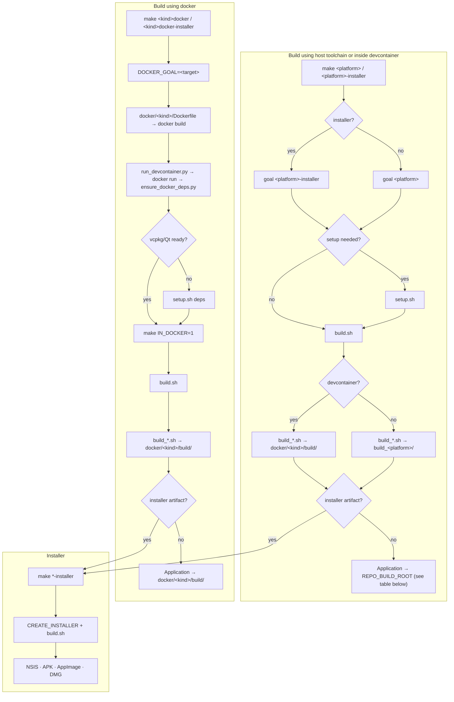

# Build guide

How to build PokerTH (for contributors and packagers).

**Top-level entrypoint:** Use the `Makefile`. Run `make help` for all targets.

## Pick a workflow

Same repo supports **native** builds, **host-driven Docker** (`make *-docker`), and **Dev Containers** (editor “Reopen in Container”).



| Output | Windows | Android | Linux | macOS |
| --- | --- | --- | --- | --- |
| **Application** | `…/deploy/` under `build_windows/` or `docker/windows/build/` | `…/android-build/` under `build_android/` or `docker/android/build/` | `build_linux/deploy/` | `build_macos/PokerTH.app` |
| **Installer** | NSIS `.exe` beside deploy tree | `…/release/*.apk` under `android-build/` | AppImage under `build_linux/` | DMG under `build_macos/` |

- **Native (no Docker):** `make <platform>` on Linux/macOS as in the sections below — outputs under `build_<platform>/`. Android on Linux can use `make android` (which will run **`make setup-android`** if needed).
- **Docker from your machine (no editor devcontainer):** `make windows-docker`, `make android-docker`, or installer variants — runs `scripts/run_devcontainer.py`, then `ensure_docker_deps.py`, then `make` inside the container. Use when you want the forced-container path or automation/CI.
- **Dev Container:** Open the **repo root**, pick `.devcontainer/windows/` or `.devcontainer/android/`. In the integrated terminal, run `make windows` / `make android` (not `make *-docker` — the Makefile blocks that). The devcontainer image sets `IN_DOCKER=1` (`docker/<kind>/Dockerfile`); `containerEnv` sets `IN_DEVCONTAINER=1`. Outputs match the Docker layout. Details, mounts, and **ensure** vs stamps: **building-developer.md**.

### Defaults, stamps, and clean

- **Default** `make`: On Linux runs `make linux`; on macOS runs `make macos`. So you can run `make` after setup and get the native build.
- **Default** `make setup`: On Linux runs `make setup-linux`; on macOS runs `make setup-macos`. Run `make setup` once to install dependencies for the current OS.
- **Stamp files:** When you run `make linux`, `make windows`, or `make macos`, Make checks for a setup stamp in that target’s build dir (**BUILD_DIR/.stamp_setup**, e.g. `build_linux/.stamp_setup`, `build_windows/.stamp_setup`, `build_macos/.stamp_setup`; Windows in Docker uses `docker/windows/build/.stamp_setup`). If the stamp is missing, it runs the corresponding setup first, then builds. So `make` or `make linux` (etc.) can be run without having run setup beforehand; setup will run once and create the stamp.
- `make clean`: Removes `build_linux/`, `build_windows/`, `build_macos/`, `build_android/`, `docker/windows/build/`, `docker/android/build/` and the setup stamp files. After that, the next `make` or `make linux` (etc.) will run setup again.

## Summary by platform

| Platform | Setup | Build | Build dir | Notes |
|----------|--------|-------|-----------|--------|
| **Linux** (native) | `make setup-linux` or `make setup` (on Linux) | `make linux` or `make` (on Linux) | `build_linux/` | Qt 6.4.2+ (e.g. Ubuntu 24.04 system Qt). Deploy: `build_linux/deploy/` (binary + data). |
| **Windows** (cross from Linux; or Docker on macOS) | `make setup-windows` (Linux) or none (macOS: Docker) | `make windows` | `build_windows/` or `docker/windows/build/` (Docker) | Linux: MinGW + vcpkg + Qt. macOS: **make windows** runs in Docker. Local output: `build_windows/deploy/`. Docker: **make windows-docker** → `docker/windows/build/deploy/`. |
| **macOS** | `make setup-macos` or `make setup` (on macOS) | `make macos` or `make` (on macOS) | `build_macos/` | Homebrew, vcpkg, Qt via aqtinstall. Produces `.app` bundle. |
| **Android** | Host: **make setup-android** (**VCPKG_DIR**) provisions SDK/NDK/Gradle/Qt + vcpkg; Docker on macOS | `make android` or `make android-docker` | `build_android/` (host) or `docker/android/build/` (Docker `IN_DOCKER=1`) | Linux: **build_android.sh** via **build.sh**. macOS: **make android** uses Docker. Image: **docker/android** Dockerfile `final` runs **setup.sh** (**TARGET_PLATFORM=android** → **setup_android.sh**), like Windows. Ensure: **setup.sh** when vcpkg/protobuf missing, then **make android**. |

- **Clean rebuild:** `make clean` (removes build dirs and stamps) or `CLEAN=yes make linux` (or make windows / make macos) wipes the build dir and reconfigures from scratch. If you see "Makefile not found", "Configure incomplete", or cache/toolchain errors, run `CLEAN=yes make <target>` and retry.
- **Create installer:** `make linux-installer`, `make windows-installer`, or `make macos-installer` — Linux: AppImage (linuxdeployqt); Windows: NSIS (makensis); macOS: DMG.
- **Usage:** Pass any argument (e.g. `--help`) to a setup or build script to print usage and exit.
- **Build targets:** `pokerth_client` (default), `pokerth_qml-client`, `pokerth_dedicated_server`, `pokerth_official_server`, `pokerth_chatcleaner`. Override with `BUILD_TARGET=…`.

### Makefile targets

Shortcuts: `all`, `setup`, `clean`, `help`

Setups: `setup-linux`, `setup-windows`, `setup-macos`, `setup-android` (**VCPKG_DIR** required).

Builders: `linux`, `windows`, `windows-docker`, `macos`, `android`, `android-docker`

Installers: `linux-installer`, `windows-installer`, `windows-docker-installer`, `macos-installer`, `installers`

Options passed by environment: e.g. `CLEAN=yes make linux` (or `CLEAN=yes make <target>`).

**Windows vs Android:** `make windows` / `make android` follow the same idea: on Linux they use the host toolchain when you have it configured; on macOS there is no host Android/Windows cross toolchain, so `make android` and `make windows` run the Docker flow. Use `make android-docker` or `make windows-docker` to force Docker on any host.

---

## Linux

1. **Setup (once):** `make setup-linux` or `make setup` (on Linux). Or run `./scripts/setup.sh` (dispatcher → **setup_linux.sh**; may need sudo). If you skip this, `make linux` or `make` will run setup automatically (creates `build_linux/.stamp_setup` when done).
2. **Build:** `make linux` or `make` (on Linux) → binary in `build_linux/bin/` and deploy dir in `build_linux/deploy/`.
3. **Run:** `cd build_linux/deploy && ./pokerth_client` or `./build_linux/bin/pokerth_client` (bin has `data` pointing to repo data).
4. **Optional:** `make linux-installer` or `CREATE_INSTALLER=yes TARGET_PLATFORM=linux ./scripts/build.sh` runs **build_linux.sh** (via **build.sh**) and linuxdeployqt to create an AppImage (deploy dir is always created; this only adds the AppImage step). **make setup-linux** installs linuxdeployqt to `~/bin` if missing; ensure `~/bin` is in your PATH (e.g. `export PATH="$HOME/bin:$PATH"` in `.bashrc`). To install manually, see [linuxdeployqt releases](https://github.com/probonopd/linuxdeployqt/releases). linuxdeployqt needs Qt6’s **qmake** to find plugins; the build script prefers Qt6 qmake over system `/usr/bin/qmake` (Qt5). If you see “qmake: could not exec … No such file or directory”, install Qt6 qmake (e.g. `apt install qmake6` or `qt6-tools-dev`) so the script can pass it to linuxdeployqt.

**Deploy directory:** Like Windows, every Linux build creates `build_linux/deploy/` with the binary and `deploy/data` pointing to repo data (no copy). `build_linux/bin/data` also points to repo data so running from `bin/` works.

**Script behavior:** Reuses `build_linux/` by default; reconfigure only on path change or if you run `CLEAN=yes` / remove the build dir (see Summary above).

**Ubuntu vs Debian:** Qt 6.4.2+ is required. Ubuntu **24.04** has Qt 6.4.2 (fine; use system Qt). Ubuntu **22.04** has Qt 6.2.x — too old; use **USE_AQT=yes make setup-linux** on 22.04 to install Qt 6.4.2+ via aqtinstall, then you can build and create the AppImage there. If you see “Could not find … Qt6 … 6.7.0”, run `CLEAN=yes make linux` to pick up the lower minimum.

**linuxdeployqt "host system is too new":** linuxdeployqt only runs on systems with glibc ≤ 2.35 (e.g. Ubuntu 22.04 Jammy) so the AppImage works on older distros. On a newer host (e.g. Ubuntu 24.04) it will error.

**For testing only:** run `LINUXDEPLOYQT_ALLOW_NEW_GLIBC=yes make linux-installer` to pass `-unsupported-allow-new-glibc`; the AppImage may not run on older distros. Other workarounds: (1) Build the AppImage in an **Ubuntu 22.04** container — use **USE_AQT=yes make setup-linux** then **make linux** and **make linux-installer** in the container (repo mounted), or (2) build and run from the deploy dir on your host (`make linux` then `build_linux/deploy/pokerth_client`) and skip the AppImage. See [linuxdeployqt #340](https://github.com/probonopd/linuxdeployqt/issues/340).

**After upgrading from Ubuntu 22.04 to 24.04:** Build entry is unchanged: use the **Makefile** (`make setup-linux`, `make linux`, `make linux-installer`). Ubuntu 24.04 has Qt 6.4.2+ (fine for building). **make linux-installer** (AppImage) fails on 24.04 ("host system too new"); use the workarounds above (run from deploy dir, or build the AppImage in a 22.04 container with **USE_AQT=yes** so Qt 6.4.2+ is used). On 22.04, system Qt (6.2.x) is too old — use USE_AQT=yes there too.

---

## Windows (cross-compile from Linux, or via Docker on macOS)

1. **On Linux:** **Setup (once):** `make setup-windows`. If you skip this, `make windows` will run setup automatically (creates `build_windows/.stamp_setup` when done). **`make windows`** and **`make windows-installer`** use the **host** MinGW cross toolchain; output is under **`build_windows/`** (see Summary table). Docker is optional — use **`make windows-docker`** / **`make windows-docker-installer`** for an all-in-container build.
2. **On macOS:** There is no host Windows cross toolchain; **`make windows`** and **`make windows-installer`** run the same flow as **`make windows-docker`** / **`make windows-docker-installer`** (Docker required).
3. **Build:** **`make windows`** → **`build_windows/deploy/`** (Linux host) or **`docker/windows/build/deploy/`** (macOS or **`make windows-docker`**). Contents under **`deploy/`** are as in [Deploy directory layout](#deploy-directory-layout) below.

**NSIS (makensis):** Required only for `make windows-installer`. We assume it is already installed: on Linux run `make setup-windows` (which installs the `nsis` package), or install it yourself (e.g. `apt install nsis`). In the Windows Docker image, **setup_linux.sh** (via **setup.sh**) does not re-run apt for nsis when `SKIP_SYSTEM_PACKAGES=yes`; the **base** image stage already installed **windows-apt-packages.txt** (includes nsis). **build_linux.sh** does not install nsis; it fails with a clear message if `makensis` is missing.

**Script behavior:** Same reuse logic as Linux (reconfigure on path change or `CLEAN=yes`; see Summary). If broken on host: `CLEAN=yes make windows`. If broken in Docker: remove `docker/windows/build` then `make windows-docker`. Launchers `pokerth_launcher.bat` and `run_pokerth.sh` are copied from **scripts/**.

### Deploy directory layout

Typical layout under **`build_windows/deploy/`** or **`docker/windows/build/deploy/`** (same on-disk shape; host vs Docker uses different `REPO_BUILD_ROOT` — see Summary table). Windows packaging assets (`installer.nsi`, `pokerth.ico`) live in `docker/windows/`.

```
build_windows/deploy/
├── pokerth_client.exe
├── Qt6*.dll, libgcc_s_seh-1.dll, libstdc++-6.dll, libwinpthread-1.dll
├── qt.conf
├── data/
└── plugins/platforms/qwindows.dll
```

### Testing on Windows

1. Open `build_windows/deploy/` on a path Windows can run from (local disk, share, or WSL2 `\\wsl$\…\build_windows\deploy`). If Windows cannot see the build tree, copy the entire `deploy/` tree to your Windows machine.
2. Run `pokerth_client.exe` from that folder; keep the directory layout intact (see above).

**Troubleshooting:** See [windows_troubleshooting.md](windows_troubleshooting.md) (e.g. 0xc0000022, DEP, antivirus, missing DLLs). For build failures on the Linux build host before you test on Windows, see the **Linux** section above.

### Building in Dev Container (Windows)

Same **`run_devcontainer.py`** plan and host caches as **`make windows-docker`**: open the **repository root** in Cursor/VS Code and use `.devcontainer/windows/devcontainer.json` (image `docker/windows/Dockerfile`). Repo at `/workspaces/pokerth`; the image sets **`IN_DOCKER=1`**, so **`scripts/functions.sh`** sets **`VCPKG_DIR`** / **`QT_OUTPUT_DIR`** under **`docker/windows/build/`**. **`ensure_docker_deps.py`** may run **`setup.sh deps`** before the inner **`make windows`**. The **`Makefile`** passes **`REPO_BUILD_ROOT`** into **`build.sh`** (**`build_linux.sh`**), so binaries land in **`docker/windows/build/deploy/`**. On failure, check **`docker/windows/build/vcpkg/buildtrees/`** logs. Prerequisites: [README_windows.md](../docker/windows/README_windows.md). Mounts, **ensure**, and stamps: **building-developer.md**.

### OpenSSL MinGW (SIO_UDP_NETRESET)

When building OpenSSL for the MinGW triplet, OpenSSL’s QUIC code uses the Windows constant `SIO_UDP_NETRESET`, which is not defined in older MinGW headers. The setup script automatically patches vcpkg’s OpenSSL port to add `no-quic` for MinGW so the build succeeds. The patch is in `scripts/patches/vcpkg-openssl-mingw-no-quic.patch` and is applied once when you run setup with a mingw triplet.

---

## macOS

1. **Setup (once):** `make setup-macos` or `make setup` (on macOS). Or run `./scripts/setup_macos.sh`. Requires Xcode and Xcode command line tools. If you skip this, `make macos` or `make` will run setup automatically (creates `build_macos/.stamp_setup` when done).
2. **Build:** `make macos` or `make` (on macOS) → builds into `build_macos/` and creates `build_macos/PokerTH.app`.
3. **Optional:** `make macos-installer` or `CREATE_INSTALLER=yes ./scripts/build_macos.sh` creates a DMG installer after the app bundle.

**Script behavior:** Reuses `build_macos/` by default; `CLEAN=yes make macos` for a full reconfigure. Uses vcpkg for Boost, Protobuf, etc., and Qt from aqtinstall. Canonical versions in **scripts/versions.env** (e.g. QT_VERSION 6.9.3); if the build fails on a version, check there. Override with env if needed.

---

## Android

1. **macOS:** `make android` or `make android-docker` — Docker: `ensure_docker_deps.py android` may run `setup.sh deps` (`TARGET_PLATFORM=android` → `setup_android.sh`) when **vcpkg** or **Qt** (`qt-cmake`) checks fail, then `make android` → `build.sh` → `build_android.sh`.
2. **Linux (host build):** `make setup-android` provisions Android SDK/NDK, Gradle, Qt (when needed), and vcpkg ports. Requires `VCPKG_DIR` (e.g. `export VCPKG_DIR=build_android/vcpkg`) and Java (e.g. `sudo apt install openjdk-17-jdk`). Host caches: `~/.pokerth-android/` (SDK, NDK, Gradle, Qt). After setup, `make android` succeeds without manual environment setup. Or use `make android-docker` for an all-in-container flow (vcpkg cache `docker/android/build/vcpkg`).
3. **Output:** There is **no** per-ABI top-level directory (not `build_android/<arch>/`): `scripts/build_android.sh` uses one CMake tree — host `build_android/`, Docker `docker/android/build/` — and passes `-DANDROID_ABI=` for the chosen arch. Unsigned APK: `android-build/build/outputs/apk/release/` under that tree (e.g. host `build_android/android-build/...`, Docker `docker/android/build/android-build/...`). Native libs: `android-build/libs/<ABI>/`. Default ABI (e.g. `arm64-v8a`) from `ANDROID_ARCH` if set, else `build_android.sh`; override `make android ANDROID_BUILD_ARGS="--arch …"` (same tree, different ABI subdirs and CMake config).
4. **APK packaging:** `build_android.sh` runs `androiddeployqt` with `--release` so Qt performs `buildAndroidProject()` and Gradle `assembleRelease` (canonical upstream flow). The launcher icon must resolve as `res/drawable/ic_launcher.png` under `QT_ANDROID_PACKAGE_SOURCE_DIR` (widget: `src/gui/qt/android/res/drawable/`; QML: `src/gui/qt6-qml/android/...`). Those paths are **symlinks** to the canonical `data/gfx/gui/misc/windowicon_transparent.png` (one PNG on disk, no duplicate binaries). `build_android.sh` copies package source into `android-build` with `cp -L` so symlinks become real files there. `CLEAN=yes make android-docker` removes `$(REPO_BUILD_ROOT)/android-build` before packaging when the Android/Gradle tree needs a full reset (same intent as a clean Gradle tree).
5. **Other architectures:** `make android ANDROID_BUILD_ARGS="--arch x86_64"` or match `VCPKG_TRIPLET` to the ABI when using `setup-android`. See [README_android.md](../docker/android/README_android.md).

---

## Script roles

- **Top-level entry:** Use `make` (see `make help`). Scripts live in `scripts/`: `setup.sh` / `build.sh` dispatch to `setup_linux.sh` / `build_linux.sh` (linux + windows on Linux), `setup_android.sh` / `build_android.sh`, `setup_macos.sh` / `build_macos.sh`.
- **Default goals:** On Linux, `make` = `make linux` and `make setup` = `make setup-linux`. On macOS, `make` = `make macos` and `make setup` = `make setup-macos`.
- **Stamp files:** See [Defaults, stamps, and clean](#defaults-stamps-and-clean). **`ensure_docker_deps.py`** may run **`setup.sh deps`** when vcpkg/Qt are missing; it does **not** touch **`.stamp_setup`**. The inner **`make`** creates the stamp via the Makefile stamp rules when required.
- **Setup scripts:** `setup.sh` dispatches: `setup_linux.sh` (linux/windows host), `setup_android.sh`, `setup_macos.sh`.
- **Build scripts:** `build.sh` dispatches: `build_linux.sh`, `build_android.sh`, `build_macos.sh`.
- **make clean:** Removes build dirs and stamps.
- **vcpkg:** Host default `~/vcpkg` (`VCPKG_DIR`). Docker **run**: `docker/windows/build/vcpkg`, `docker/android/build/vcpkg`. `ensure_docker_deps.py` runs before `make` in `*-docker` flows when **vcpkg** ports or **Qt** (`qt-cmake` under the mounted Qt tree) are not ready, then `setup.sh deps`. Details: **building-developer.md**.
- **Devcontainers:** Windows and Android use `.devcontainer/<kind>/devcontainer.json`; **Dockerfiles** live at `docker/<kind>/Dockerfile` (optional **Windows** compose: `docker/windows/docker-compose.yml`). `build.context` `..` is the **repo root** (relative to `.devcontainer/<kind>/`). `build.options` (e.g. `--platform=linux/amd64` for **Docker image** OS/arch, not PokerTH `platform`) is passed to `docker build`; `runArgs` to `docker run`. Images set `IN_DOCKER=1`; `containerEnv` sets `IN_DEVCONTAINER=1` so `make android` / `make windows` use `docker/<kind>/build/`; `make *-docker` is for the **host** only—the Makefile errors if you run it inside the Dev Container. `make X-docker` uses `scripts/run_devcontainer.py`, which reads the same `devcontainer.json`. Full table: **building-developer.md**.
- **`create_serverlist.sh`** (root): Expects `./build/bin/zlib_compress`. Binary is at `build_linux/bin/zlib_compress`; symlink `build` → `build_linux` or run it manually.

**Build system details (scripts, env, reconfigure, Docker):** [building-developer.md](building-developer.md).
